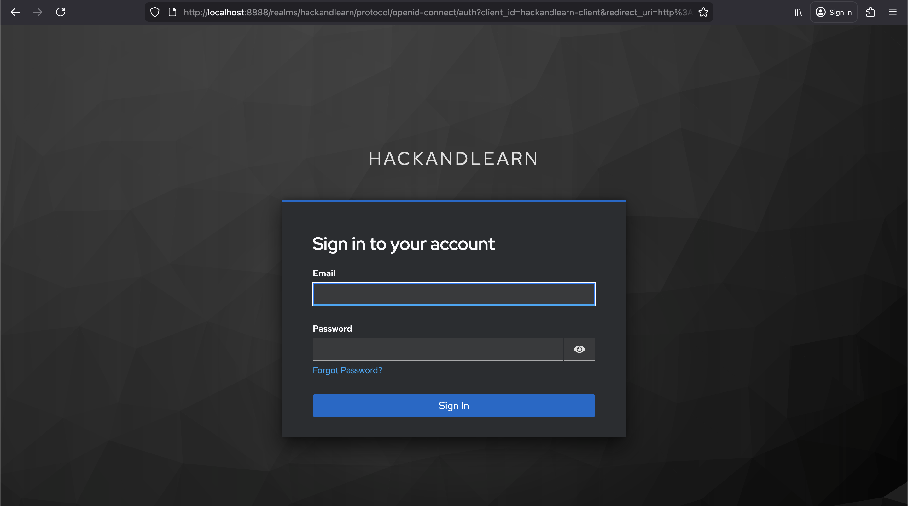
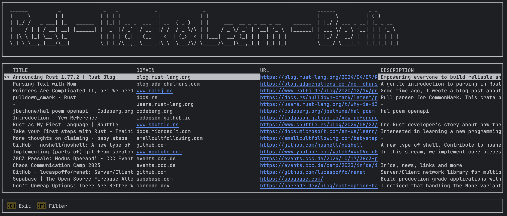

# Rust - Berlin Hack and Learn Challenge

## Purpose

This implementation is a adaptation of the Rust UserGroup **Rust Hack and Learn** Berlin 
challenge: https://github.com/andreasklostermaier/halreslib in different Frameworks.

My choice **Leptos** as Frontend.

Link to the meetup group: https://berline.rs/

Even whe most of features are implemented and functional, there is still room for progress...

## Implementation

SALT = (S)urrealDB (A)xum (L)eptos (T)ailwind + GraphQL

The Frameworks in use:

Frontend:

* Leptos 0.8.14
* Thaw 0.5.0-Beta
* Tailwind 4.0
* GraphQL Query + Mutation + Subscription

Backend:

* Axum 0.8.3
* Tower 0.5.2 (Static Page Server)
* async-graphql (GraphQL)

Database:

* SurrealDB

## Installation / Preparation

* Rust: https://www.rust-lang.org/tools/install
* Trunk: https://trunkrs.dev/guide/getting-started/installation.html
* TailwindCss: https://tailwindcss.com/docs/installation/using-vite

PS: For TailwindCss I use the Mac Brew option:

```shell
brew update
brew install tailwindcss
```

## Running

The implementation uses Trunk to generate and run the Client Side Pages. It includes Hot Reloading

```bash
trunk serve --open
```

## Build

```bash
trunk build --release --public-url "/web"
```

The files generated in the client folder /dist can be moved on the
Server side to the folder /static. To access to the files from Axum
you need to manually adapt in the index.html file the relative path
for the links as the wasm file:

Example:

href="rust-berlin-leptos-7a6a9f219c87d073.js" --> href="/web/rust-berlin-leptos-7a6a9f219c87d073.js"

## Starting the Backend:

```bash
cd server
cargo run
```

The different links on the Backend side:

```text
Server on:        http://127.0.0.1:8080
Leptos client on: http://127.0.0.1:8080/web
Graphiql on:      http://127.0.0.1:8080/graphiql
Playground on:    http://127.0.0.1:8080/playground
```

## Security

There are currently 2 users implemented with KeyCloak. 

- admin@demo.com:password
- user@demo.com:password



## Improvements

- Review SurrealDB specially for SQL Injection and Query Builder
- Review and Optimize code for removing .clone()
- Review and Optimize Signals
- Review and Optimize Component Communication
- Fixing Loging / Refresh actions
- Fixing bugs ;-)
- ...

## Bonus

A module for using Ratatui is under client-ratatui

## Features to plan:

- Add a Security Layer 

## Links

Leptos Documentation:

https://book.leptos.dev/

For playing with Tailwind:

https://play.tailwindcss.com/


