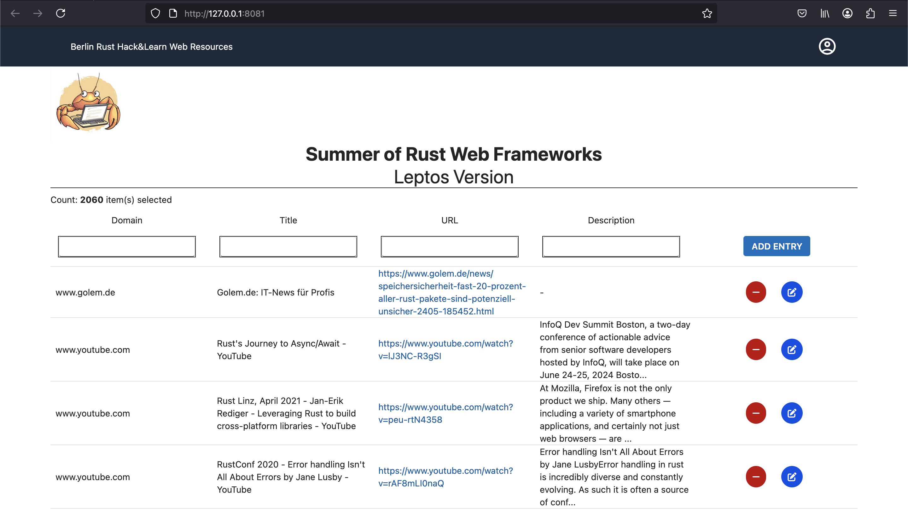

# Rust - Berlin Clone

## Purpose

This implementation is a clone implementation of the Rust UserGroup
**Rust Hack and Learn** in Berlin of the implementation: https://github.com/andreasklostermaier/halreslib (Original).

Link to the group: https://berline.rs/

Even whe most of features are implemented and functional, there is still some work in progress...

## Implementation

SALT = (S)urrealDB (A)xum (L)eptos (T)ailwind + GraphQL

The Frameworks in use:

Frontend:

* Leptos 0.7.8
* Thaw 0.4.6
* Tailwind 4.0
* GraphQL Query + Mutation + Subscription

Backend:

* Axum 0.8.3
* Tower 0.5.2 (Static Page Server)
* Juniper Axum (GraphQL)

Database:

* SurrealDB

## Installation / Preparation

* Rust: https://www.rust-lang.org/tools/install
* Trunk: https://trunkrs.dev/guide/getting-started/installation.html
* TailwindCss: https://tailwindcss.com/docs/installation/using-vite

PS: For TailwindCss I use the Mac Brew option:

```shell
brew update
brew install tailwindcss
```

## Running

The implementation uses Trunk to generate and run the Client Side Pages. It includes Hot Reloading

```bash
trunk serve --open
```

## Build

```bash
trunk build --release
```

The files generated in the client folder /dist can be moved on the 
Server side to the folder /static. To access to the files from Axum
you need to manually adapt in the index.html file the relative path
for the links as the wasm file: 

Example:

href="rust-berlin-leptos-7a6a9f219c87d073.js" --> href="/web/rust-berlin-leptos-7a6a9f219c87d073.js"

## Links

Leptos Documentation:

https://book.leptos.dev/

For playing with Tailwind:

https://play.tailwindcss.com/

